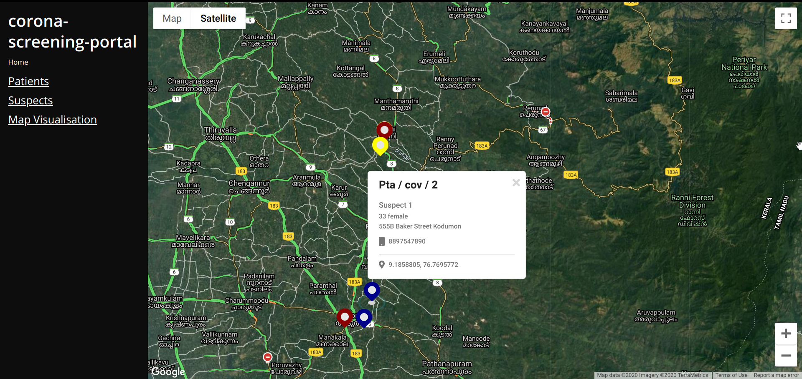

# corona-screening-portal

This is an internal project developed for Pathanamthitta District(in Kerala, India) for Geo-tagging Corona Patients & Contacts, for the analysis of outbreak in March 2020
<h3>🙋‍♂️ Made by <a href="https://twitter.com/_abhijithv">@abhijithvijayan</a></h3>

  Donate:
  <a href="https://www.paypal.me/iamabhijithvijayan" target='_blank'><i><b>PayPal</b></i></a>,
  <a href="https://www.patreon.com/abhijithvijayan" target='_blank'><i><b>Patreon</b></i></a>

  

## License

MIT © [Abhijith Vijayan](https://abhijithvijayan.in)